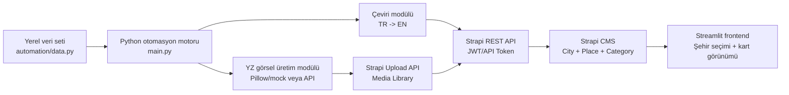

# BIP210 İçerik Yönetimi Final Projesi Raporu

## 1. Kapak Sayfası

**Proje adı:** YZ Destekli Çok Dilli Dinamik Gastronomi Gezi Rehberi  
**Ders:** BIP210 İçerik Yönetimi  
**Ad Soyad:** [Adınızı ve soyadınızı yazın]  
**Öğrenci No:** [Öğrenci numaranızı yazın]  
**Teslim:** Final haftası

## 2. Sistem Mimarisi Şeması



Sistem üç ana bölümden oluşur:

- **Backend:** Strapi CMS üzerinde `City`, `Place` ve `Category` koleksiyonları tutulur. `Place` kayıtları şehir, kategori ve kapak görseli ilişkilerine sahiptir.
- **Otomasyon:** Python betiği şehir, kategori ve mekan verilerini işler; İngilizce açıklamayı hazırlar, kapak görseli üretir, görseli Strapi Media Library'ye yükler ve kayıtları REST API üzerinden oluşturur.
- **Frontend:** Streamlit arayüzü Strapi REST API'den şehirleri ve seçilen şehre ait mekanları çeker, kullanıcıya filtrelenebilir kart düzeninde sunar.

## 3. Erişim Bilgileri

**Strapi Admin Paneli:** http://localhost:1337/admin  
**Strapi API:** http://localhost:1337/api  
**Streamlit Frontend:** http://localhost:8501  

**Admin kullanıcı adı/e-posta:** [Strapi admin hesabınızı yazın]  
**Admin şifresi:** [Teslim için gerekiyorsa yazın]

API erişimi için `automation/.env` ve `frontend-streamlit/.env` dosyalarında şu değişkenler kullanılır:

```env
STRAPI_URL=http://localhost:1337
STRAPI_API_TOKEN=buraya_strapi_api_tokeninizi_yazin
USE_MOCK_TRANSLATION=true
USE_MOCK_IMAGES=true
```

## 4. Teknik Detaylar ve Kodlar

### Strapi Koleksiyonları

**City**

- `name`: Şehir adı
- `country`: Ülke
- `short_description`: Şehir hakkında kısa bilgi
- `places`: Şehre bağlı mekanlar için one-to-many ilişki

**Place**

- `name`: Mekan/içerik adı
- `description_tr`: Türkçe açıklama
- `description_en`: İngilizce açıklama
- `category_name`: Kategori adı için yedek metin alanı
- `rating`: 0-5 arası puan
- `cover_image`: Strapi Media Library görsel ilişkisi
- `city`: City koleksiyonuna many-to-one ilişki
- `category`: Category koleksiyonuna many-to-one ilişki

**Category**

- `name`: Kategori adı
- `description`: Kategori açıklaması
- `places`: Kategoriye bağlı mekanlar için one-to-many ilişki

### Python Otomasyon Akışı

Ana dosya: `automation/main.py`

1. `data.py` içindeki şehir, kategori ve mekan verileri okunur.
2. `translator.py` ile Türkçe açıklamaların İngilizce karşılığı hazırlanır. Veri setinde İngilizce açıklama varsa doğrudan kullanılır.
3. `image_generator.py` ile her mekan için kapak görseli üretilir. API anahtarı yoksa Pillow tabanlı mock görsel oluşturulur.
4. `strapi_client.py` görseli `/api/upload` endpoint'ine yükler.
5. Mekan kaydı `/api/places` endpoint'ine şehir, kategori ve medya ilişkileriyle birlikte gönderilir.

### Streamlit Frontend

Ana dosya: `frontend-streamlit/app.py`

- `fetch_cities()` şehir listesini Strapi'den çeker.
- Kullanıcı sidebar üzerinden şehir seçer.
- `fetch_foods_by_city()` fonksiyonu artık `/api/places` endpoint'inden seçili şehirdeki mekanları çeker.
- Kart görünümünde Türkçe açıklama, İngilizce açıklama, kategori, şehir, puan ve kapak görseli gösterilir.

## 5. Sistem Kanıtı ve Ekran Görüntüleri

PDF rapora eklenmesi gereken ekran görüntüleri:

- Strapi Content-Type Builder ekranı: `City`, `Place`, `Category` koleksiyonları ve ilişkiler.
- Strapi Content Manager ekranı: otomasyon öncesinde boş veya az veri durumu.
- Python otomasyon çıktısı: kategori, şehir, görsel yükleme ve mekan oluşturma adımları.
- Strapi Content Manager ekranı: otomasyon sonrasında dolu `Place` kayıtları.
- Strapi Media Library ekranı: yüklenen kapak görselleri.
- Streamlit arayüzü: şehir seçimi ve seçilen şehir için mekan kartları.

Ekran görüntüleri `report/screenshots/` klasörüne kaydedilebilir.

## 6. Çalıştırma Sırası

```bash
cd backend-strapi
npm install
npm run develop
```

Strapi admin panelinde API token oluşturulduktan sonra:

```bash
cd automation
copy .env.example .env
pip install -r requirements.txt
python main.py
```

Frontend için:

```bash
cd frontend-streamlit
copy .env.example .env
pip install -r requirements.txt
streamlit run app.py
```

## 7. Rubrik Uyumluluk Özeti

- **Veri modelleme:** `City`, `Place`, `Category` koleksiyonları ve one-to-many/many-to-one ilişkiler kuruldu.
- **API ve güvenlik:** Python otomasyonu Strapi API Token/JWT Bearer header ile REST API'ye veri gönderir.
- **YZ ve çeviri:** TR/EN açıklama alanları, çeviri modülü ve mock/API uyumlu görsel üretim modülü kullanıldı.
- **Dosya yönetimi:** Üretilen görseller yerelde kalmakla yetinmez; Strapi Upload API ile Media Library'ye yüklenir.
- **Frontend sunumu:** Streamlit arayüzü şehir filtresi ile seçilen şehre ait mekanları modern kart düzeninde gösterir.
- **Kod düzeni:** Backend, otomasyon, frontend ve rapor klasörleri ayrıdır; kodlar modüler fonksiyonlara bölünmüştür.
